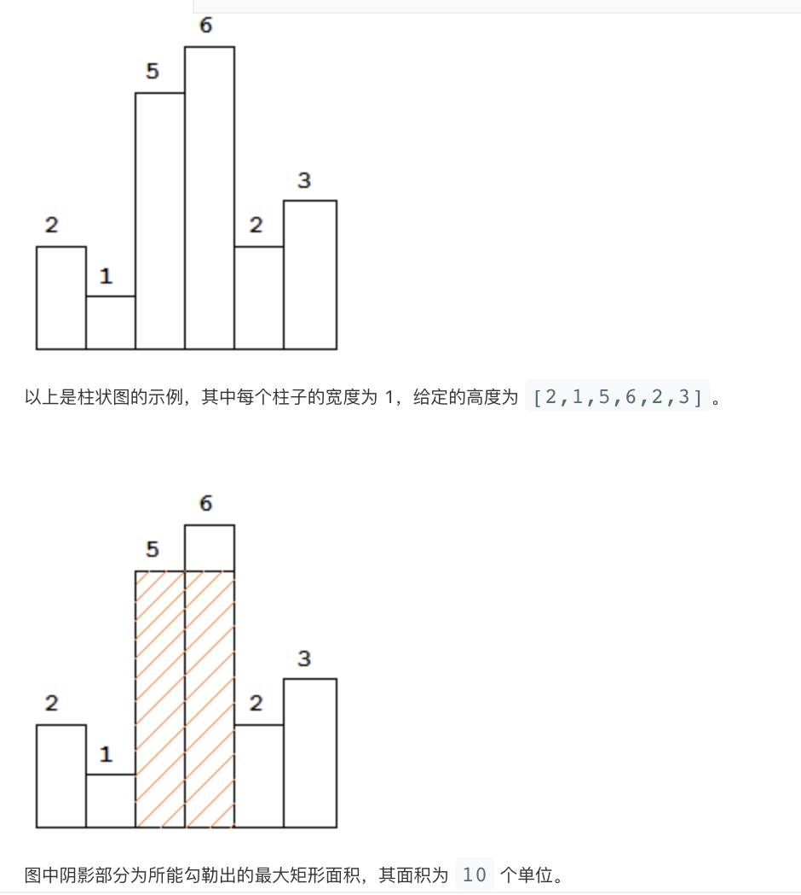

给定 n 个非负整数，用来表示柱状图中各个柱子的高度。每个柱子彼此相邻，且宽度为 1 。

求在该柱状图中，能够勾勒出来的矩形的最大面积。



**示例:**
```
输入: [2,1,5,6,2,3]
输出: 10
```

**思路1:** 暴力, 超出内存
+ 计算任意两个位置i, j之间的最大矩形面积
+ dp[i][j]记录(i, j)之间的最小高度
```
# 超出内存限制
class Solution:
    def largestRectangleArea(self, heights: List[int]) -> int:
        n = len(heights)
        dp = [[float('inf')] * n  for _ in range(n)]
        max_area = 0
        for i in range(n):
            dp[i][i] = heights[i]
            max_area = max(max_area, heights[i])
        for i in range(n):
            for j in range(i+1, n):
                dp[i][j] = min(dp[i][j-1], heights[j])
                area = dp[i][j] * (j - i + 1)
                max_area = max(area, max_area)
        return max_area
```
**空间优化:** 超出时间限制, 但通过了94个测试用例（一共96个）
```
# 将二维降成一维
class Solution_2:
    def largestRectangleArea(self, heights: List[int]) -> int:
        n = len(heights)
        dp = [float('inf')] * n
        max_area = 0
        for i in range(n):
            dp[i] = heights[i]
            max_area = max(max_area, dp[i])
            for j in range(i+1, n):
                dp[j] = min(dp[j-1], heights[j])
                area = dp[j] * (j - i + 1)
                max_area = max(area, max_area)
        return max_area
```

**递增栈**

**递增栈的思路是参考的网上的题解。**

在每个位置i, 计算在以height[i]为高度的最大矩形，高度已经确定，这是只需要确定左、右边界。左边界指的在i左边(从右往左)第一个height值小于height[i]的索引left_i, 右边界指的是i右边(从左往右)第一个height值小于height[i]的索引right_i。

对于位置0, left_0 = -1, 对于位置n-1， right_n-1 = n

下面分析递增栈解决上述问题的思路.

递增栈中存储的是递增序列的索引， 所以对于栈首元素top位置的height[top], 其左边界是pop 出top后的栈元素，右边界是top之后第一个小于height[top]的值或者是n。

**具体操作如下:**
+ -1入栈
+ 从左至右遍历heights中的每一个元素(i, heights[i])
    + 当栈中元素除了-1之外还有元素，并且heights[stack[top]] > heights[i]:
        + 栈首元素出栈top = pop()，并计算面积 (i - stack.top() - 1) * heights[top], stack.top是出栈后的信你的元素
        + 更新最大面积
    + 入栈 i
+ 计算递增栈中剩余元素的面积并更新最大面积

**时间复杂度分析:**

heights数组中每个索引值i都会入栈，而每个栈中元素i都会求解以位置的height[i]为高度的最大面积, 其实是对每一个heights中每一个数访问了一次。时间复杂度为O(n)。

使用了辅助栈，空间复杂度为O(n)。

代码如下:
```
# 递增栈
class Solution:
    def largestRectangleArea(self, heights: List[int]) -> int:
        if not heights:
            return 0
        stack = []
        stack.append(-1)
        max_area = 0
        for i in range(len(heights)):
            while len(stack) > 1 and heights[stack[-1]] > heights[i]:
                top = stack.pop()
                area = heights[top] * (i - stack[-1] - 1)
                max_area = max(max_area, area)
            stack.append(i)
        while len(stack) > 1:
            top = stack.pop()
            max_area = max(max_area, heights[top] * (len(heights) - stack[-1] - 1))
        return max_area
```

递增栈的思路太巧妙了，竟然可以使用O(n)的复杂度解决了问题。